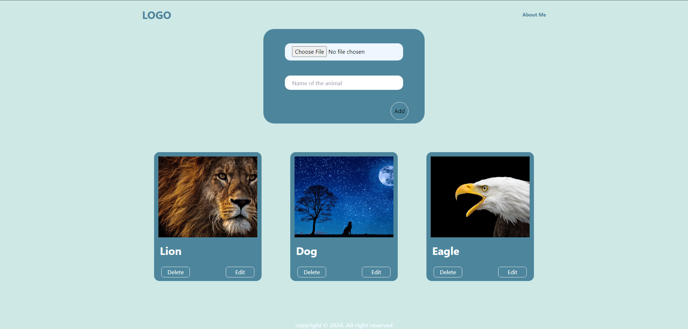

# React + Vite + Cloudinary

## Web Page were you can add your favourite animals with there cute images.

<<<<<<< HEAD
Live Link [Animal Lover](https://animallover.netlify.app)

=======
>>>>>>> b4c3e9aa1b7cb51aa4ac8973c617a7f84c7a4afd
- It's complete frontend project where you can add , update and delete.
- For Image I used cloudinary service and use the generated url to show the images.
- Creating Context to avoid prop drilling.

<<<<<<< HEAD
---

=======
  
>>>>>>> b4c3e9aa1b7cb51aa4ac8973c617a7f84c7a4afd

Currently, two official plugins are available:

- [@vitejs/plugin-react](https://github.com/vitejs/vite-plugin-react/blob/main/packages/plugin-react/README.md) uses [Babel](https://babeljs.io/) for Fast Refresh
- [@vitejs/plugin-react-swc](https://github.com/vitejs/vite-plugin-react-swc) uses [SWC](https://swc.rs/) for Fast Refresh
